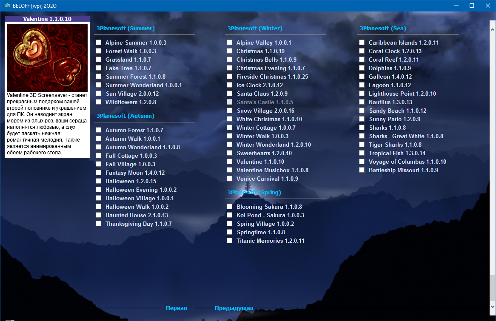

<h1 align="center">🚀 Format Sonrası Programların Avtomatik Yüklənməsi</h1>
<p align= "center"> YAXINDA PAYLAŞACAM!> /p>
<p align="center">
  Format sonrası lazım olan proqramların <b>1 kliklə avtomatik qurulması</b> üçün hazırlanmış alət.<br>
  <b>Əkbər Mahmudov</b> tərəfindən hazırlanmışdır.
</p>

<p align="center">
  
  
  
</p>

---

## 📦 Layihə Haqqında

**oto-setup**, Windows əməliyyat sistemi üçün formatdan sonra tez-tez quraşdırılan proqramların bir kliklə, səssiz şəkildə (silent install) qurulmasını təmin edir. Əsas məqsəd **vaxt itkisini azaltmaq** və **təkrar əməliyyatları avtomatlaşdırmaqdır**.

---

## 🔧 Əsas Xüsusiyyətlər

- ✅ 1 kliklə bütün proqramların quraşdırılması  
- ✅ Sessiz (silent) və fon rejimində quraşdırma  
- ✅ Proqram yoxdursa xəbərdarlıq göstərilməsi  
- ✅ Quraşdırma log faylı  
- ✅ Minimalist və şık PyQt5 interfeysi  
- ✅ Office versiyası seçimi (2010 / 2016 / 2019)  
- ✅ "Hamısını Yüklə" düyməsi ilə toplu quraşdırma  
- ✅ USB-dən işləyən portativ sistem

---

## 📌 Quraşdırıla Bilən Proqramlar

<p align="center">
  
  
  
  
  
  
  
  
  
  
  
  
  
  
  
  
</p>


## 📸 Ekran Görüntüləri

<!-- Buraya .png və ya .gif şəklində bir neçə screenshot əlavə edə bilərsən -->
<p align="center">
  
</p>

---

## 🧩 İstifadə Edilən Texnologiyalar

- 💻 Python (PyQt5)
- 📁 NSIS və ya AutoIt ilə silent setup dəstəyi
- 🧠 Ağıllı qovluq yoxlaması və bildiriş sistemi
- 🖼️ particles.js (ulduzlu fon effekti üçün)
- 🧁 capolengui.js (Optimizasiya ve XML dən infoları çəkmək üçün)

---

## ⚙️ İstifadə Qaydası

```bash
1. Layihəni yüklə və ya klonla
2. setup.py və ya exe faylını işə sal
3. Lazım olan proqramları seç
4. “Hamısını Yüklə” düyməsinə kliklə
```
